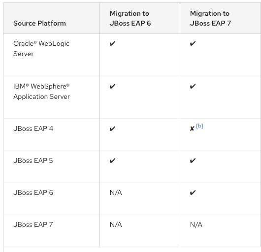

# migrations-wildfly-java

[https://docs.wildfly.org/](https://docs.wildfly.org/)

important : La couche persistence n'est pas mentionnée...

## Existant

Struts 1.1, Hibernate 3.6.10.Final / Tomcat 7.0 / Java 6

(Servlet 3.0, Java EE 6)

## Cible WildFly 13 ?

[https://docs.wildfly.org/13/Getting_Started_Guide.html](https://docs.wildfly.org/13/Getting_Started_Guide.html)

Mai 2018. 

Releasé avant la LTS Java 11. A priori compatible Java 8, 9, 10.

Java EE 7.

Java 8 donc migration Struts 1.1 vers Spring MVC (Spring 5)

JPA 2.1, Hibernate 5.1.x

[https://hibernate.org/orm/releases/5.1/](https://hibernate.org/orm/releases/5.1/)

[https://github.com/hibernate/hibernate-orm/blob/5.1/migration-guide.adoc](https://github.com/hibernate/hibernate-orm/blob/5.1/migration-guide.adoc)

## Cible Wildfly 15 ?

[https://www.wildfly.org/news/2018/12/13/WildFly15-Final-Released/](https://www.wildfly.org/news/2018/12/13/WildFly15-Final-Released/)

[https://docs.wildfly.org/15/Getting_Started_Guide.html](https://docs.wildfly.org/15/Getting_Started_Guide.html)

Décembre 2018.

Première version compatible Java 11. Compatible Java 8, 9, 10, 11.

Java EE 8.

Java 11 donc migration Struts 1.1 vers Spring MVC (Spring 5)

JPA 2.2, Hibernate 5.4.x

[https://hibernate.org/orm/releases/5.4/](https://hibernate.org/orm/releases/5.4/)

[https://github.com/hibernate/hibernate-orm/blob/5.4/migration-guide.adoc](https://github.com/hibernate/hibernate-orm/blob/5.4/migration-guide.adoc)

## Conclusion

Pour éviter un trop grand gap :

Migration Struts 1.1, Hibernate 3.6.10 / Tomcat 7.0 (Servlet 3.0 - Java EE 6) / Java 6

vers Spring 5 MVC, Hibernate 5.1.x / Wildfly 13 (Servlet 3.1, JPA 2.1 - Java EE 7) / Java 8

Il faudra plus tard migrer vers Spring 5 MVC, Hibernate 5.4.x / Wildfly 21 (Servlet 4.0, JPA 2.2 - Java EE 8) / Java 11

## V2

Pb existence applet + struts 1.1 :

cible "ReactJS, RESTEasy", Hibernate 5.1.x / Wildfly 13 (JAX-RS 2.0, JPA 2.1 - Java EE 7) / Java 8

cible suivante "ReactJS, RESTEasy", Hibernate 5.4.x / Wildfly 21 (JAX-RS 2.1, JPA 2.2 - Java EE 8) / Java 11

# Annexes

## "Equivalences" Java EE JBoss EAP et WildFly

[http://www.mastertheboss.com/jboss-server/jboss-eap/what-is-the-difference-between-jboss-eap-wildfly-and-jboss-as](http://www.mastertheboss.com/jboss-server/jboss-eap/what-is-the-difference-between-jboss-eap-wildfly-and-jboss-as)

[https://access.redhat.com/articles/113373](https://access.redhat.com/articles/113373)

| Java EE       | JBoss EAP    | WildFly       |
| ------------- | -------------| ------------- |
| 7             | 7.0 et 7.1   | 8 à 13        |
| 8             | 7.2 et 7.3   | 14 à 21       |

## Red Hat Application Migration Toolkit

[https://access.redhat.com/documentation/en-us/red_hat_application_migration_toolkit/4.2/](https://access.redhat.com/documentation/en-us/red_hat_application_migration_toolkit/4.2/)

Migration paths:
[https://access.redhat.com/documentation/en-us/red_hat_application_migration_toolkit/4.2/html/getting_started_guide/supported_configurations](https://access.redhat.com/documentation/en-us/red_hat_application_migration_toolkit/4.2/html/getting_started_guide/supported_configurations)

## Support Java Oracle et OpenJDK

[https://www.oracle.com/java/technologies/java-se-support-roadmap.html](https://www.oracle.com/java/technologies/java-se-support-roadmap.html)

[https://access.redhat.com/articles/1299013](https://access.redhat.com/articles/1299013)

## Migration Java > 8

*Migrer une application de Java 8 à Java 11 n'impose pas de modulariser le code de l'application.*

Mais la JRE a été modularisée depuis Java 9. Par exemple [les classes de JAXB ont été déplacées dans un module](https://www.jesperdj.com/2018/09/30/jaxb-on-java-9-10-11-and-beyond/). Il y a donc des actions à mener pour les réinclure dans le(s) classpath(s).

### migrer le code applicatif en modules

Il faut définir le graphe des dépendences. Un projet qui n'a pas de dépendence est tout en bas du graphe.

Si besoin, diviser un gros projet en modules, pour ensuite définir le graphe des dépendences.

#### bottom-up

1. Dans le graphes de dépendences, identifier le projet de plus bas niveau qui n'a pas encore été migré.
2. Ajouter le module-info.java à ce projet. Penser aux exports et requires.
3. Déplacer ce module du classpath au module path.

A ce moment, tous les projets non migrés sont des *unnamed modules* dans le classpath. Tous les projets migrés sont des *named modules* dans le module path.

4. Recommencer avec le projet suivant de plus bas niveau dans le graphe.

#### top-down

1. Placer tous les projets dans le module path.
2. Dans le graphes de dépendences, identifier le projet de plus haut niveau qui n'a pas encore été migré.
3. Ajouter le module-info.java à ce projet. Penser aux exports et requires.

A ce moment, tous les projets non migrés sont des *automatic modules* dans le module path. Tous les projets migrés sont des *named modules* dans le module path.

4. Recommencer avec le projet suivant de plus haut niveau dans le graphe.

